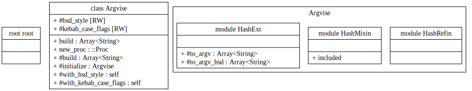

# Argvise

[](https://rubygems.org/gems/argvise)

<!-- [](https://www.rubydoc.info/gems/argvise) -->

A Ruby gem for converting hash structures into command-line argument arrays.

> **Note:** This is *not* a command-line parser — quite the opposite. Argvise helps you **build** CLI commands programmatically.

## API DOC



- Github Pages: <https://2moe.github.io/argvise-gem>

## Quick Start

```ruby
# IRB
system "gem install argvise"
```

### `Hash#to_argv`

```ruby
# RUBY
require 'argvise'

using Argvise::HashRefin
  # OR: include Argvise::HashMixin

raw_cmd_hash = {
  cargo: (), b: (), r: true, target: "wasm32-wasip2"
}

raw_cmd_hash
  .to_argv
  # .to_argv({bsd_style: false, kebab_case_flags: true})

#=> ["cargo", "b", "-r", "--target", "wasm32-wasip2"]
```

`raw_cmd_hash.to_argv` is equivalent to:

```ruby
raw_cmd_hash
  .then(&Argvise.new_proc)
  .with_bsd_style(false) #=> GNU style
  .with_kebab_case_flags(true) #=> replace "--cli_flag" with "--cli-flag"
  .build
```

### `Hash#to_argv_bsd`

```ruby
require 'argvise'
using Argvise::HashRefin

accel = %w[kvm hvf whpx].join ':'

{
  'qemu-system-aarch64': (),
  machine: "none,accel=#{accel}",
  cpu: 'host',
  display: 'none',
  nodefaults: true,
  no_user_config: true,
  qmp: 'stdio',
}.to_argv_bsd
# => ["qemu-system-aarch64",
#   "-machine", "none,accel=kvm:hvf:whpx",
#   "-cpu", "host",
#   "-display", "none",
#   "-nodefaults",
#   "-no-user-config",
#   "-qmp", "stdio"]
```

## mruby

[More details](../mruby/Readme.md)

## Conversion Rules

### Common

| Hash Format             | Result                       |
| ----------------------- | ---------------------------- |
| `{ "-k2": nil }`        | `["-k2"]`                    |
| `{ "--r_a-w_": nil }`   | `["--r_a-w_"]`               |
| `{ key: nil }`          | `["key"]`                    |
| `{ key: () }`           | `["key"]`                    |
| `{ key: [] }`           | `[]`                         |
| `{ key: {} }`           | `[]`                         |
| `{ key: false }`        | `[]`                         |
| `{ k: true }`           | `["-k"]`                     |
| `{ k: "value" }`        | `["-k", "value"]`            |
| `{ k: ["a", "b"] }`     | `["-k", "a", "-k", "b"]`     |
| `{ k: { a: 1, b: 2 } }` | `["-k", "a=1", "-k", "b=2"]` |

### GNU Style

| Hash Format               | Result                             |
| ------------------------- | ---------------------------------- |
| `{ key: true }`           | `["--key"]`                        |
| `{ key: "value" }`        | `["--key", "value"]`               |
| `{ key: ["a", "b"] }`     | `["--key", "a", "--key", "b"]`     |
| `{ key: { a: 1, b: 2 } }` | `["--key", "a=1", "--key", "b=2"]` |

---

#### `with_kebab_case_flags(true)`

| Hash Format       | Result        |
| ----------------- | ------------- |
| `{ key_a: true }` | `["--key-a"]` |

---

#### `with_kebab_case_flags(false)`

| Hash Format       | Result        |
| ----------------- | ------------- |
| `{ key_b: true }` | `["--key_b"]` |

### BSD Style

| Hash Format               | Result                           |
| ------------------------- | -------------------------------- |
| `{ key: true }`           | `["-key"]`                       |
| `{ key: "value" }`        | `["-key", "value"]`              |
| `{ key: ["a", "b"] }`     | `["-key", "a", "-key", "b"]`     |
| `{ key: { a: 1, b: 2 } }` | `["-key", "a=1", "-key", "b=2"]` |

---

<!-- markdownlint-disable MD024 no-duplicate-heading -->

#### `with_kebab_case_flags(true)`

| Hash Format       | Result       |
| ----------------- | ------------ |
| `{ key_c: true }` | `["-key-c"]` |

---

#### `with_kebab_case_flags(false)`

| Hash Format       | Result       |
| ----------------- | ------------ |
| `{ key_d: true }` | `["-key_d"]` |

### Notes

> When the value of a flag key is `nil`, the `kebab_case_flags` option has
> no effect — i.e., the key will not be transformed.
>
> For example, the input `{"a_b-c": nil}` will result in `["a_b-c"]`,
> and **not** be automatically transformed into `["a-b-c"]`.

## Examples

### Basic Conversion (GNU Style)

```ruby
require 'argvise'

raw_cmd_hash = {
  docker: (),  #=> docker
  build: (),
  push: true, #=> --push
  tag: ["ghcr.io/[user]/repo:latest", "ghcr.io/[user]/repo:v0.0.1"], #=> --tag ghcr... --tag ghcr..0.0.1
  platform: "wasi/wasm", #=> --platform wasi/wasm
  label: {
    maintainer: "user",
    description: "A Docker build example"
  }, # => --label maintainer=user --label description=A..example
  file: "wasi.dockerfile",
  path: (),
}

Argvise.build(raw_cmd_hash)
# => [
#   "docker", "build", "--push",
#   "--tag", "ghcr.io/[user]/repo:latest", "--tag", "ghcr.io/[user]/repo:v0.0.1",
#   "--platform", "wasi/wasm",
#   "--label", "maintainer=user", "--label", "description=A Docker build example",
#   "--file", "wasi.dockerfile", "path"
# ]
```

### Shortcut

#### Mixin

```ruby
require 'argvise'

module A
  module_function
  include Argvise::HashMixin

  def demo
    { path: '/path/to/dir' }.to_argv.then { p it }
    #=> ["--path", "/path/to/dir"]

    { path: '/path/to/dir' }.to_argv_bsd.then { p it }
    #=> ["-path", "/path/to/dir"]
  end
end

A.demo
Hash.method_defined?(:to_argv) # => true
{}.respond_to?(:to_argv) #=> true
```

#### Refinement

```ruby
require 'argvise'
class A
  using Argvise::HashRefin

  def self.demo
    { target: "wasm32-wasip2" }.to_argv.then { p it }
      # => ["--target", "wasm32-wasip2"]

    { target: "wasm32-wasip2" }.to_argv_bsd.then { p it }
      # => ["-target", "wasm32-wasip2"]

    {}.respond_to?(:to_argv).then { p it } #=> true
  end
end

A.demo
Hash.method_defined?(:to_argv) # => false
{}.respond_to?(:to_argv) #=> false
```

### Configurable builder

> Required
>
> - argvise: >= v0.0.9
> - ruby: >= v3.1.0

```ruby
raw_cmd = {
  compiler: (),
  build: (),
  pack_type: 'tar+zstd',
  push: true,
  v: true,
  f: 'p2',
  tag: ['v0.0.1', 'beta'],
  platform: 'wasi/wasm',
  label: {
    maintainer: 'user',
    description: 'Demo'
  },
  "/path/to/dir": ()
}

p '----------------'
p "GNU-style + kebab case flags=false"
# argvise: >= v0.0.4
raw_cmd
  .then(&Argvise.new_proc)
  .with_bsd_style(false)
  .with_kebab_case_flags(false)
  .build
  .display

#=> ["compiler", "build", "--pack_type", "tar+zstd", "--push", "-v", "-f", "p2", "--tag", "v0.0.1", "--tag", "beta", "--platform", "wasi/wasm", "--label", "maintainer=user", "--label", "description=Demo", "/path/to/dir"]

p '----------------'

# argvise: >= v0.0.9
using Argvise::HashRefin

p 'GNU-style + kebab-case-flags=true'
# argvise: >= v0.0.6
raw_cmd
  .to_argv
  .display

#=> ["compiler", "build", "--pack-type", "tar+zstd", "--push", "-v", "-f", "p2", "--tag", "v0.0.1", "--tag", "beta", "--platform", "wasi/wasm", "--label", "maintainer=user", "--label", "description=Demo", "/path/to/dir"]

p '----------------'
p 'BSD-style + kebab-case-flags=true'
# argvise: >= v0.0.9
raw_cmd
  .to_argv_bsd
  .display

#=> ["compiler", "build", "-pack-type", "tar+zstd", "-push", "-v", "-f", "p2", "-tag", "v0.0.1", "-tag", "beta", "-platform", "wasi/wasm", "-label", "maintainer=user", "-label", "description=Demo", "/path/to/dir"]
p '----------------'
```

## Data Type

### Boolean

#### GNU style

- `{ verbose: true }` => `["--verbose"]`
- `{ v: true }` => `["-v"]`
- `{ v: false }` => `[]`

#### BSD style

- `{ verbose: true }` => `["-verbose"]`
- `{ v: true }` => `["-v"]`
- `{ v: false }` => `[]`

### String

#### GNU style

- `{ f: "a.txt" }` => `["-f", "a.txt"]`
- `{ file: "a.txt" }` => `["--file", "a.txt"]`

#### BSD style

- `{ f: "a.txt" }` => `["-f", "a.txt"]`
- `{ file: "a.txt" }` => `["-file", "a.txt"]`

### Array

#### GNU style

- `{ t: ["a", "b"] }` => `["-t", "a", "-t", "b"]`
- `{ tag: %w[a b] }` => `["--tag", "a", "--tag", "b"]`

#### BSD style

- `{ t: ["a", "b"] }` => `["-t", "a", "-t", "b"]`
- `{ tag: %w[a b] }` => `["-tag", "a", "-tag", "b"]`

### Hash

#### GNU style

- `{ e: { profile: 'test', lang: 'C'} }` => `["-e", "profile=test", "-e", "lang=C"]`
- `{ env: { profile: 'test', lang: 'C'} }` => `["--env", "profile=test", "--env", "lang=C"]`

#### BSD style

- `{ e: { profile: 'test', lang: 'C'} }` => `["-e", "profile=test", "-e", "lang=C"]`
- `{ env: { profile: 'test', lang: 'C'} }` => `["-env", "profile=test", "-env", "lang=C"]`

## Nil => Raw

- `{ cargo: () }` => `["cargo"]`
- `{ cargo: nil, b: nil }` => `["cargo", "b"]`
- `{ "-fv": () }` => `["-fv"]`

## Changelog

### v0.0.6 (2025-11-05)

Breaking Change:

- `cmd_hash |> hash_to_argv` => `cmd_hash.to_argv(opts)`
  - Previous: `{a: true}.then(&hash_to_argv)`
  - Current: `{a: true}.to_argv`

### v0.0.9 (2025-11-30)

- add refinements for Hash
- add `Hash#to_argv_bsd`

Breaking Change:
  - Mitigated side effects introduced by monkey patching.
    - Previous:
      - Simply calling `require 'argvise'` was enough to import `Hash#to_argv`;
      - no explicit `include` or `using` was required.
    - Current:
      - We must manually `include Argvise::HashMixin` or `using Argvise::HashRefin` to import `Hash#to_argv`.
